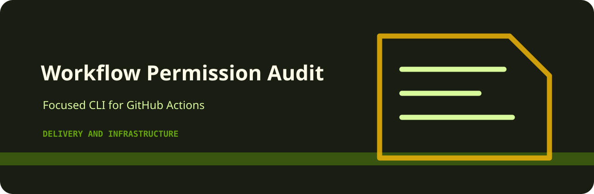

# Workflow Permission Audit

<p align="center">
  
</p>

   

Audit CI workflow snippets for broad permissions and risky triggers.

## The short version

`workflow-permission-audit` is intentionally small: feed it a file, get deterministic findings, and decide whether the result should block a merge or just guide cleanup.

## Rule surface

| Rule | Severity | What it catches |
| --- | --- | --- |
| `write-all` | high | workflow has broad write permissions |
| `pull-request-target` | medium | pull_request_target trigger detected |
| `secrets-available` | low | secrets may be available to workflow |

## Usage

```bash
python -m pip install -e ".[dev]"
workflow-permission-audit examples/sample.txt
workflow-permission-audit examples/sample.txt --json --fail-on medium
```

## Useful defaults

| Option | Reason |
| --- | --- |
| `--json` | machine-readable output for scripts |
| `--fail-on medium` | stricter CI gate when warnings matter |
| `--format auto` | let the reader detect text, CSV, JSON, or JSONL |

## Local checks

```bash
python -m pip install -e ".[dev]"
ruff check .
pytest
python -m workflow_permission_audit --help
```
