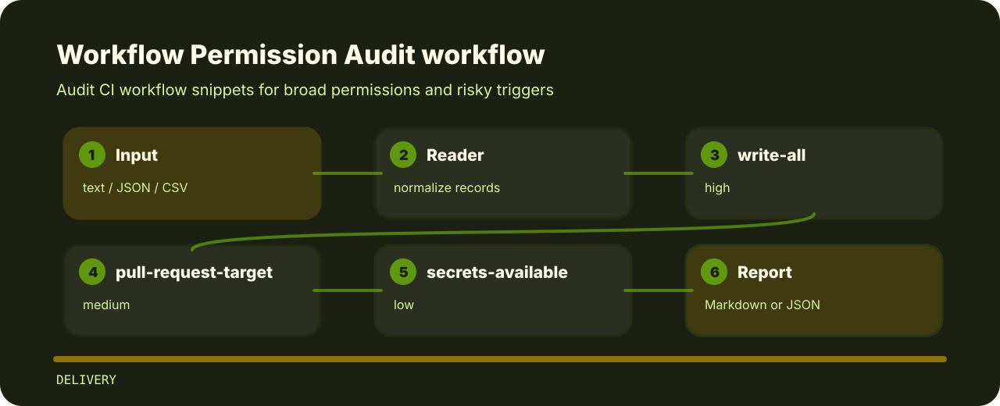

# Workflow Permission Audit


Audit CI workflow snippets for broad permissions and risky triggers.

## Before the fix

```text
risky: permissions write-all pull_request_target secrets available
clean: permissions contents:read pull_request secrets none
```

## What gets flagged

| Signal | Level | What it flags | Fix direction |
| --- | --- | --- | --- |
| `write-all` | high | workflow has broad write permissions | Use least-privilege permissions per job. |
| `pull-request-target` | medium | pull_request_target trigger detected | Review untrusted code execution paths. |
| `secrets-available` | low | secrets may be available to workflow | Restrict secrets to trusted branches and jobs. |

## Signal route



## Try the fixture

```bash
git clone https://github.com/mertefekurt/workflow-permission-audit.git
cd workflow-permission-audit
python -m pip install -e ".[dev]"
workflow-permission-audit examples/sample.txt
```
